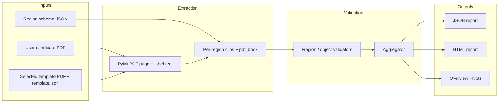

# visual-validation

Reference-based **visual QA** for IKEA product labels. The repo supports **two complementary surfaces**:

| Surface | Entry | What gets compared |
|--------|--------|---------------------|
| **Raster pipeline** | `scripts/validate.py`, `LabelValidator` | Template vs label **images** after preprocess + homography alignment; SSIM / pixel / edge / tiles (optional **pixel** ignore zones). |
| **Region PDF pipeline** | `scripts/validate_label.py`, `generate_region_report.py` | Approved **template PDF** vs **candidate PDF** using a **hand-authored region schema** (`config/regions/<PRODUCT>.json`): per-region typed checks, aggregation, JSON/HTML + page overviews. |

Full technical detail for the PDF path: **[docs/REGION_VALIDATOR.md](docs/REGION_VALIDATOR.md)**.

---

## Table of contents

1. [Two validation surfaces](#two-validation-surfaces)
2. [What it does](#what-it-does)
3. [What it does not do](#what-it-does-not-do)
4. [PDF-to-PDF region pipeline (architecture)](#pdf-to-pdf-region-pipeline-architecture)
5. [Thesis stance: why not ML-first](#thesis-stance-why-not-ml-first)
6. [Limitations (current)](#limitations-current)
7. [Features](#features)
8. [Requirements & installation](#requirements--installation)
9. [Project layout](#project-layout)
10. [Quick start](#quick-start)
11. [CLI reference](#cli-reference)
12. [Comparison modes: `full` vs `region_split`](#comparison-modes-full-vs-region_split)
13. [How the pipeline works (raster)](#how-the-pipeline-works)
14. [Optional zones](#optional-zones)
15. [Outputs & reports](#outputs--reports)
16. [Configuration](#configuration)
17. [Ground truth & product codes](#ground-truth--product-codes)
18. [Python API](#python-api)
19. [Calibration](#calibration)
20. [Tests](#tests)
21. [Troubleshooting](#troubleshooting)
22. [Region PDF pipeline CLI](#region-pdf-pipeline-cli)

---

## Two validation surfaces

See the [introduction](#visual-validation) table. Use **raster** validation when you have flattened artwork and care about global appearance after alignment. Use the **region PDF** path when you have **vector PDFs**, need **explainable per-field failures**, or want **layout-first** checks (`--layout-only`) that treat text and barcode **payload** as variable while still enforcing **geometry** and tolerances in mm.

---

## What it does

### Raster pipeline (`validate.py`)

You provide:

1. A **label file**: PDF (typical) or raster (PNG, JPEG, TIFF, BMP, WebP).
2. A **product code** matching `ground_truth/templates/<CODE>/` (no auto-detection).

The tool loads the template image, **aligns** the test image (ORB + RANSAC homography), runs **multi-signal** comparison (SSIM, pixel diff, edges, tile grid), optional **optional_zones** ignore mask, optional **region_split** verdict, and writes annotated PNGs + JSON + HTML.

### Region PDF pipeline (`validate_label.py`)

You provide:

1. A **candidate label PDF** (same logical label as the template family).
2. A **product code** and optional **template version** (`vN`).

The tool resolves **template** `label.pdf` + `template.json`, loads **region schema**, extracts **named region clips** from both PDFs, runs **typed validators** (legacy or `--layout-only`), **aggregates** mandatory weighted scores, and writes **JSON / HTML / template + candidate overview PNGs**. **Page index** and **page size** are validated so the wrong page is never compared silently (see [docs/REGION_VALIDATOR.md](docs/REGION_VALIDATOR.md)).

---

## What it does not do

- **No ML-first layout detection** or learned scoring as the primary gate (see [Thesis stance](#thesis-stance-why-not-ml-first)).
- **No automatic product/template pick** — you must pass `--product` (and optionally `--version`).
- **No barcode / GS1 semantic verification** in the PDF pipeline by default: legacy checks **presence/density**; layout mode checks **ink bbox and geometry**, not decoded values.
- **No proof** of regulatory compliance — engineering validation aid only.

---

## PDF-to-PDF region pipeline (architecture)



**Flow in words:** user PDF + selected template → **PDF document / page extraction** (`extract_regions`) → **region schema loading** (`load_region_config_file`) → **region/object validators** (`validate_extractions` or `validate_layout_extractions`) → **aggregator** (`aggregate_region_scores`) → **JSON/HTML** (`build_report_payload`, `write_html_report`) + rasterised overviews.

---

## Thesis stance: why not ML-first

- **Templates are fixed artefacts** (approved PDFs + ground-truth JSON). The task is conformance to a **known** layout, not open-world object detection.
- **Deterministic geometry** (PDF points, mm tolerances, ink bboxes, optional vector hints) gives **repeatable** results suitable for audit and thesis argumentation.
- **Region metadata** yields **explainable** failures (which field, which mm shift, which bbox), whereas an end-to-end ML score is harder to defend without auxiliary interpretability work.
- **ML layout detectors** would introduce training-data bias, variance across runs (unless frozen), and operational overhead **without** replacing the need for explicit tolerances against the approved template.

Layout-only mode deliberately avoids using **full-page SSIM** as the main decision; scoring stays **region-typed** and **PDF/layout**-grounded.

---

## Limitations (current)

- **Aspect consistency** (`label_size_mm` vs PDF page aspect) runs in layout mode only when **`label_rect_pts` is unset**; with a crop rect, that check is skipped (full media box aspect would be misleading).
- **Layout `severity`** (`critical` / `warning` in details) does **not** yet independently override aggregation; verdict remains driven by mandatory pass/fail and global score threshold.
- **Region JSON** allows sensible **defaults** (e.g. omitted `mandatory` / `weight`) for backward compatibility — not every field is required at parse time.
- **Pipeline hardening** (page count, page index, page-size mismatch) is covered strongly in **unit** tests; not every failure mode has a dedicated CLI integration test.

More detail: [docs/REGION_VALIDATOR.md — Limitations](docs/REGION_VALIDATOR.md#limitations-current).

---

## Features

| Feature | Description |
|--------|-------------|
| **Multi-signal scoring** | Weighted combination of SSIM, pixel similarity, edge similarity, and per-tile pass rate. |
| **Alignment** | Perspective warp so the test label sits in the same frame as the template (handles mild rotation/skew; can distort if inputs mismatch badly). |
| **Optional zones** | Per–product-code JSON rectangles where differences **do not** count toward scores (empty optional fields, variant blocks). |
| **Region split** | Default verdict can be based on **mandatory quadrants** only, with full-image metrics kept as **reference** in reports. |
| **Reports** | PNG artefacts + JSON + self-contained HTML with embedded images. |

---

## Requirements & installation

- **Python 3.10+** recommended (project may run on newer versions; use a **venv** on macOS if `pip` refuses system installs).
- Dependencies are listed in [`requirements.txt`](requirements.txt) (OpenCV, scikit-image, NumPy, Pillow, PyMuPDF, etc.).

```bash
cd visual-validation
python3 -m venv .venv
source .venv/bin/activate          # Windows: .venv\Scripts\activate
pip install -r requirements.txt
```

**Always run CLI scripts from the `visual-validation/` directory** so imports and default paths resolve correctly.

---

## Project layout

| Path | Purpose |
|------|---------|
| `scripts/validate.py` | Main CLI entry point |
| `scripts/validate_label.py` | One-shot region pipeline + report (strict schema by default) |
| `scripts/generate_region_report.py` | Same region pipeline with verbose paths |
| `scripts/generate_all_region_schemas.py` | Batch-create `config/regions/*.json` from templates |
| `scripts/calibrate.py` | Threshold helper on folders of known-good labels |
| `docs/REGION_VALIDATOR.md` | PDF region pipeline: schemas, types, limits, CLI snippets |
| `src/validator.py` | `LabelValidator` public API (raster path) |
| `src/reporting/pipeline_runner.py` | Region PDF orchestration + gates + reports |
| `src/reporting/region_report.py` | JSON/HTML payload and tables |
| `src/core/region_aggregator.py` | Weighted scores → VALID / INVALID |
| `src/core/region_validators.py` | Legacy per-region typed checks |
| `src/core/layout_region_validators.py` | `--layout-only` geometry / structure checks |
| `src/core/pdf_layout_gate.py` | Page count/index + page-size pre-checks (layout mode) |
| `src/core/comparator.py` | Raster scoring, region split, mismatch regions |
| `src/core/alignment.py` | Preprocess + homography alignment |
| `src/core/optional_zones.py` | Load optional-zone JSON + ignore mask |
| `src/config/settings.py` | `ValidationConfig` defaults |
| `config/regions/*.json` | Per–product-code region schemas (PDF pipeline) |
| `config/optional_zones/*.json` | Per–product-code optional rectangles (raster path) |
| `data/templates/.../ground_truth/` | Approved templates (do not edit as part of normal app work) |
| `tests/` | `test_pipeline.py`, `test_layout_validation.py`, `test_layout_hardening.py`, … |

---

## Quick start

```bash
cd visual-validation
source .venv/bin/activate   # if using a venv

# List every product code and template path
python scripts/validate.py --list-templates

# Validate one label (replace PRODUCT with a real code from the list)
python scripts/validate.py "data/labels/my_label.pdf" --product PRODUCT --version v1 --output outputs/

# Run tests
pytest tests/ -v
```

**Important:** `--product` must be the **exact** directory name under `ground_truth/templates/`, not a placeholder like `YOUR-PRODUCT-CODE`.

---

## Region PDF pipeline CLI

Besides pixel-level comparison (`scripts/validate.py`), this package includes a **region PDF pipeline**: it crops named regions from the approved template and your candidate PDF, runs per-region checks, aggregates a score, and writes HTML/JSON plus **template and candidate** full-page overview images.

### List templates (product codes and versions)

Raster CLI:

```bash
python scripts/validate.py --list-templates
```

PDF pipeline (same `ground_truth` tree; lists folders under `templates/`):

```bash
PYTHONPATH=. python -c "
from pathlib import Path
from src.core.template_store import GroundTruthTemplateCatalog
root = Path('data/templates/ground-truth-ikea-labels/ground_truth')
cat = GroundTruthTemplateCatalog(root)
for p in cat.list_products():
    print(p, '→', ', '.join(cat.list_versions(p)))
"
```

Adjust `root` if you pass a custom `--ground-truth-dir` to `validate_label.py`.

### Validate one label (recommended entry point)

From the `visual-validation/` directory (with `PYTHONPATH=.` so `src/` resolves):

```bash
cd visual-validation
PYTHONPATH=. python scripts/validate_label.py "data/labels/label.pdf" \
  --product 1R10-PRADM \
  --version v6
```

**Multi-page PDFs:** pass `--page N` (default `0`). The pipeline requires **equal page counts** on template and candidate and refuses an out-of-range index (no silent wrong-page compare).

**Layout-first mode** (geometry / mm tolerances; ignores text and barcode **payload**):

```bash
PYTHONPATH=. python scripts/validate_label.py "data/labels/label.pdf" \
  -p 1R10-PRADM --version v6 \
  --layout-only --layout-tolerance-mm 1.5
```

**Report output directory:** `--out-dir` (default `outputs/reports/`). Paths are printed at the end of the run.

The script prints **product**, **template version**, **schema source** (`manual` or `auto-generated`), **verdict**, **final score**, paths to the **HTML report** and **overview PNG**, then exits `0` if the verdict is `VALID`, else `2`. Pass `--open-report` to open the HTML in your default browser after the run (macOS: `open`; Linux: `xdg-open`; other platforms: best-effort via Python’s `webbrowser`).

**Strict schema (default):** the pipeline requires a hand-authored region file at `config/regions/<PRODUCT>.json`. If it is missing, the run fails with a clear error—this is intentional for thesis/demo safety.

**Optional escape hatch:** pass `--allow-auto-schema` to generate an approximate schema from `template.json` under `outputs/generated_regions/` and continue. This path is **not** production-safe; use it only when you explicitly accept approximate regions.

Full verbose logging and the same pipeline (with more intermediate paths printed) are available via:

```bash
PYTHONPATH=. python scripts/generate_region_report.py "data/labels/label.pdf" \
  --product 1R10-PRADM \
  --version v6 \
  --out-dir outputs/reports
```

### Generate region schemas (batch)

To create missing `config/regions/<PRODUCT>.json` files from the latest template version for each product (skips products that already have a file):

```bash
PYTHONPATH=. python scripts/generate_all_region_schemas.py \
  --ground-truth-dir data/templates/ground-truth-ikea-labels/ground_truth \
  --out-dir config/regions
```

Use `--fallback-coarse` if the primary generator fails for a product; that writes a coarse `bbox_norm` schema and records `CREATED_FALLBACK` in the summary. See `scripts/generate_all_region_schemas.py --help` for `--validate` and label-directory options.

### Region pipeline output files

For a given candidate PDF, outputs are written under `--out-dir` (default `outputs/reports/`):

| File | Role |
|------|------|
| `report_<PRODUCT>_<safe_stem>.html` | Browser report: template + candidate overviews, per-region table, failed-region cards |
| `report_<PRODUCT>_<safe_stem>.json` | Machine-readable payload (`overall_result`, `failed_regions`, `warning_regions`, `skipped_optional_regions`, `metrics`, …) |
| `report_<PRODUCT>_<safe_stem>_overview.png` | Candidate page raster with region outlines and status colours |
| `report_<PRODUCT>_<safe_stem>_template_overview.png` | Same for the **approved template** PDF page |

With `--allow-auto-schema` only, an additional file appears under `--generated-regions-dir` (default `outputs/generated_regions/`): `<PRODUCT>_<VERSION>.json`.

---

## CLI reference

All arguments for `scripts/validate.py`:

| Argument | Description |
|----------|-------------|
| `input` | Label file (PDF/PNG/JPG/…) or directory (use with `--batch`) |
| `--product`, `-p` | **Required** for validation. Product code matching `ground_truth/templates/<CODE>/`. |
| `--version`, `-v` | Template version folder, e.g. `v1`. Default: latest available for that product. |
| `--output`, `-o` | Output directory. Default: `outputs/` |
| `--batch`, `-b` | Process all supported files in `input` directory |
| `--ground-truth` | Path to `ground_truth` root. Default: `data/templates/ground-truth-ikea-labels/ground_truth` |
| `--dpi` | PDF rasterisation DPI (overrides `ValidationConfig.render_dpi`, default 300) |
| `--threshold` | Override `valid_score_threshold` for this run |
| `--comparison-mode` | `full` or `region_split` (overrides config; see below) |
| `--list-templates`, `-l` | Print all templates and exit |
| `--no-comparison` | Skip writing the side-by-side `_comparison.png` |
| `--quiet`, `-q` | Print only `VALID` or `INVALID` |

**Exit codes**

| Code | Meaning |
|------|---------|
| `0` | VALID (or list-templates success) |
| `1` | Error (missing input, bad path, missing product, etc.) |
| `2` | INVALID |

---

## Comparison modes: `full` vs `region_split`

Controlled by `ValidationConfig.comparison_mode` (default **`region_split`**) or `--comparison-mode`.

### `full`

- A **single** weighted score is computed on the **entire** aligned image.
- **VALID** iff `final_score >= valid_score_threshold` **and** `ssim_score >= ssim_threshold`.
- Classic behaviour: one global verdict.

### `region_split` (default)

- The **same** full-image metrics are still computed and stored as **reference** (`full_image_*` in JSON / HTML).
- Additional **per-region** metrics are computed for **eight** regions: `top_half`, `bottom_half`, `left_half`, `right_half`, and the four **quadrants** (`top_left`, `top_right`, `bottom_left`, `bottom_right`).
- **Verdict** is driven by **mandatory quadrants** only: each quadrant that is not “mostly optional” (see `region_optional_ignore_fraction`) must pass the same threshold rules. Headline `final_score` / SSIM / pixel / edge / tile in the report are **aggregates** of those mandatory quadrants (see `src/core/comparator.py`).
- If **no** quadrant is scored (all optional), the tool **falls back** to the full-image verdict.

Use **`--comparison-mode full`** when you want a single global decision; use **`region_split`** to reduce false INVALID when only part of the label differs or optional areas dominate one corner.

---

## How the pipeline works

```
Label file  →  load_image (PDF @ DPI or raster)
        →  preprocess (resize to target_width × target_height, Gaussian blur)
        →  align (ORB + RANSAC homography → warp test to template)
        →  optional: load optional_zones JSON → ignore mask
        →  compare (SSIM, pixel diff, morphology, Canny edges, tile grid)
        →  optional: region_split aggregation
        →  annotate, heatmap, grid map, comparison strip, JSON, HTML
```

**Signals (default weights in `settings.py`):**

| Signal | Default weight | Role |
|--------|----------------|------|
| SSIM | 35% | Structural similarity on grey (optional pixels neutralised) |
| Pixel | 35% | Channel max diff; morphological closing; mandatory pixels only |
| Edge | 15% | Canny edge XOR (mandatory areas) |
| Tile | 15% | Grid of tiles; each tile fails if diff ratio > `tile_fail_threshold` |

**Alignment** uses a **full homography** (perspective). Clean, front-on PDFs can still be over-warped if the template and test differ strongly; check `alignment_ok` in the report and the middle column of `_comparison.png`.

---

## Optional zones

Some fields may be **empty on valid** labels (e.g. optional icons). Without zones, those differences lower the global score.

1. Create **`config/optional_zones/<PRODUCT_CODE>.json`** (filename = product code + `.json`).
2. Rectangles are in **pixel coordinates** in the **canonical** image space (`target_width` × `target_height`, same as after preprocess).

Example:

```json
{
  "product_code": "L10555-MIADM",
  "optional_zones": [
    {
      "name": "sustainability_block",
      "x": 1200,
      "y": 2100,
      "width": 250,
      "height": 180,
      "reason": "Optional on some variants"
    }
  ]
}
```

If no file exists for a product, all pixels are **mandatory**. Optional pixels are excluded from SSIM, pixel/edge scoring, tile penalties (for covered pixels), and contribute to **region** ignore logic when a region is mostly optional (`region_optional_ignore_fraction`, default `0.80`).

---

## Outputs & reports

For input stem `my_label` and output directory `outputs/`:

| File | Content |
|------|---------|
| `my_label_annotated.png` | Aligned test image with mismatch boxes (and optional-zone outlines where configured) |
| `my_label_heatmap.png` | Blended diff + SSIM heatmap |
| `my_label_grid_map.png` | Visual grid of per-tile pass/fail |
| `my_label_comparison.png` | **Template | aligned test | heatmap** (with labels) |
| `my_label_report.json` | Full `ComparisonResult.summary()` + label path, product, version |
| `my_label_report.html` | Self-contained report for a browser |

**JSON highlights**

- `valid`, `final_score`, `ssim_score`, `pixel_similarity`, `edge_similarity`, `tile_pass_rate` — **verdict** values (in `region_split`, these reflect the aggregated quadrant decision for the headline numbers).
- `full_image_*` / `full_image_valid` — full-canvas reference when using region split.
- `comparison_mode`, `region_scores`, `failed_mandatory_regions` — region-split detail.
- `mismatch_regions`, `tile_results`, `ignored_optional_zones` — spatial and optional-zone detail.

---

## Configuration

All defaults live in [`src/config/settings.py`](src/config/settings.py). Common parameters:

| Parameter | Default | Notes |
|-----------|---------|--------|
| `render_dpi` | 300 | PDF rasterisation; lower for speed (e.g. 150) |
| `target_width` / `target_height` | 1748 × 2480 | Canonical canvas (A5 @ 300 DPI style) |
| `valid_score_threshold` | 0.88 | Raise to be stricter |
| `ssim_threshold` | 0.85 | Hard floor on SSIM |
| `diff_pixel_threshold` | 18 | Per-channel diff considered “visible” |
| `noise_min_area` | 200 | Small diff blobs removed |
| `tile_fail_threshold` | 0.04 | Max allowed bad pixel ratio per tile |
| `comparison_mode` | `region_split` | or `full` |
| `region_optional_ignore_fraction` | 0.80 | Region mostly optional → skipped for region verdict |
| `weight_ssim` … `weight_tile` | 0.35, 0.35, 0.15, 0.15 | Must sum to 1.0 for interpretability |

Programmatic use: pass `ValidationConfig(...)` into `LabelValidator`.

---

## Ground truth & product codes

- Templates live under:  
  `data/templates/ground-truth-ikea-labels/ground_truth/templates/<PRODUCT>/<vN>/`
- Each version usually contains `label.pdf` and/or `label.png`.
- **`--product`** is the **folder name** `<PRODUCT>`, e.g. `L10555-MIADM`, not a free-form description.

Run `--list-templates` to see the authoritative list and file paths on your machine.

---

## Python API

```python
from pathlib import Path
from src.config.settings import ValidationConfig
from src.validator import LabelValidator

cfg = ValidationConfig(
    render_dpi=300,
    comparison_mode="region_split",  # or "full"
)

v = LabelValidator(
    ground_truth_dir="data/templates/ground-truth-ikea-labels/ground_truth",
    cfg=cfg,
    optional_zones_dir=None,  # default: project config/optional_zones
)

result = v.validate(
    label_path=Path("data/labels/my_label.pdf"),
    product_code="L10555-MIADM",
    template_version="v1",
    output_dir="outputs/",
)

print(result.verdict)           # "VALID" | "INVALID"
print(result.score)             # headline final score
print(result.comparison.comparison_mode)
print(result.comparison.full_image_final_score)  # reference when region_split
print(result.report_json, result.report_html)
```

`validate_batch` runs many files against the same product code.

---

## Calibration

On a set of **known-good** labels for one product, run:

```bash
python scripts/calibrate.py data/labels/known_good/ --product YOUR_PRODUCT_CODE
```

Use the printed recommendations to set `valid_score_threshold` / related knobs for your print pipeline.

---

## Tests

```bash
cd visual-validation
pytest tests/ -v
```

The suite uses **synthetic** images and small **on-the-fly PDFs** where needed. It covers preprocessing, alignment, comparison, optional region-split smoke tests, annotator, template store, end-to-end `LabelValidator` with a temporary ground-truth tree, **region PDF / layout** validation (`test_layout_validation.py`, `test_layout_hardening.py`), schema loading, and pipeline helpers. PyMuPDF may emit SWIG-related `DeprecationWarning`s; they are benign.

---

## Troubleshooting

| Symptom | What to check |
|--------|----------------|
| `KeyError: Product code '…' not found` | Use an exact code from `--list-templates`; no placeholders. |
| `cd: no such file or directory: visual-validation` | You are already **inside** `visual-validation/`; do not `cd` again, or `cd` from the parent `ikea-template-cropping` folder. |
| `pip` / “externally managed environment” (macOS) | Create and use a **venv** (see [Installation](#requirements--installation)). |
| Pasting `pip install ... # comment` fails | The `#` line may be parsed wrongly; run `pip install -r requirements.txt` on its own line. |
| Middle column of `_comparison.png` looks warped | Alignment homography; ensure correct `--product`/`--version` and similar label layout. |
| VALID / INVALID seems wrong | Compare `full` vs `region_split`; tune thresholds; add **optional_zones** for known optional fields. |
| `DeprecationWarning: datetime.utcnow` when running tests | Addressed in `src/utils/reporter.py` (timezone-aware UTC). Remaining warnings are usually from OpenCV/SWIG bindings. |

---

## Licence / usage

This repository is part of a label-cropping / validation workflow. Treat ground-truth assets as the source of truth for which template to use per product.
