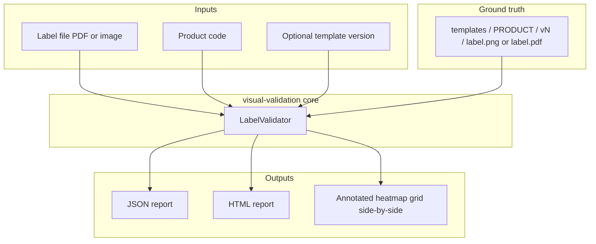
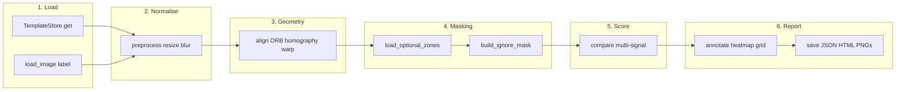
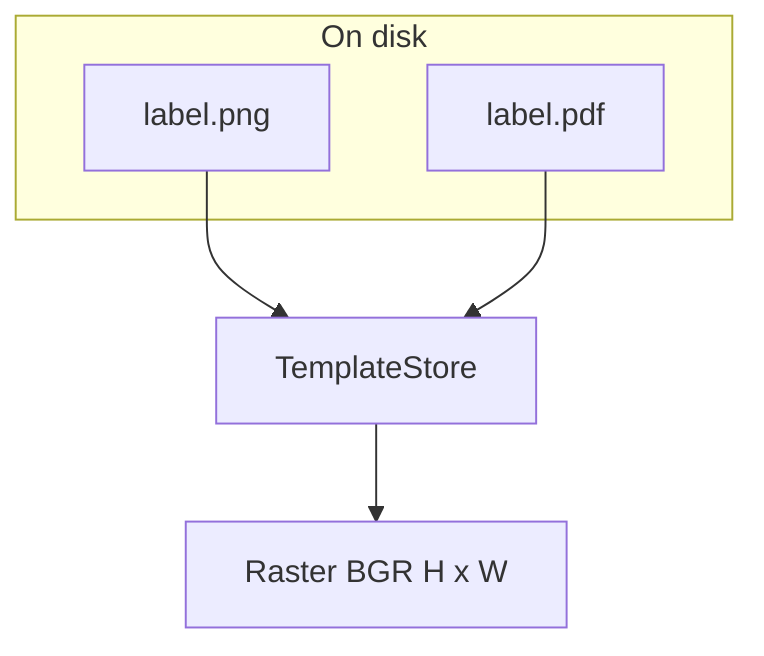
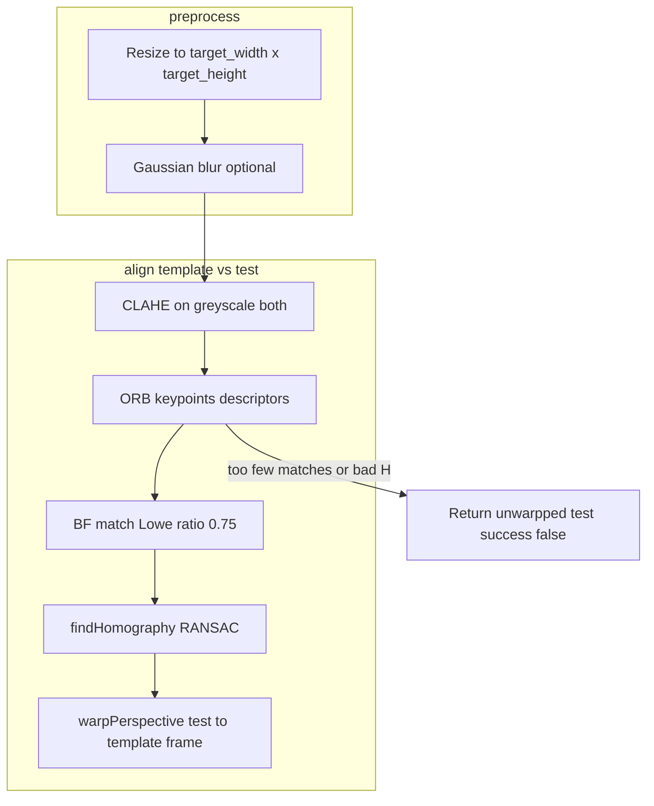
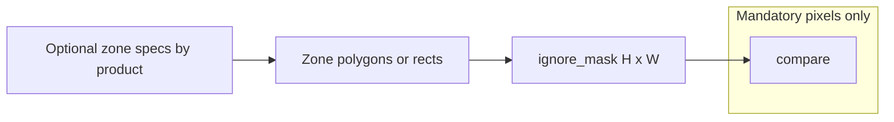
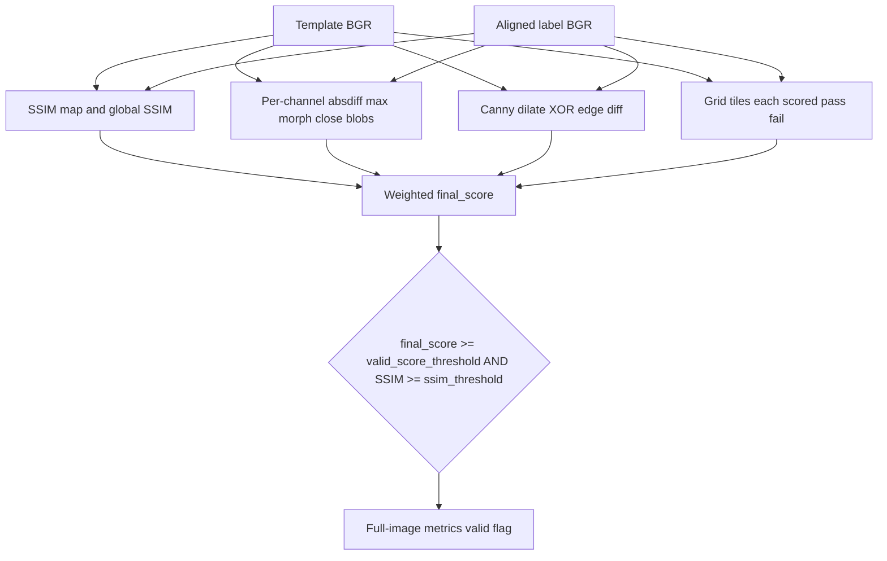
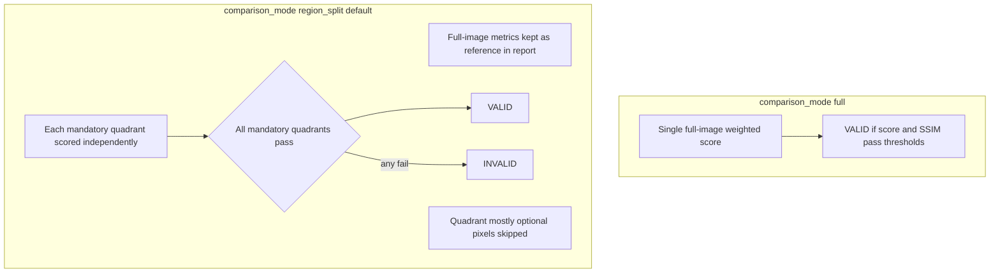
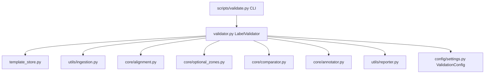

# Visual label validation — system architecture

This document describes how the **IKEA label visual validator** is structured: what components exist, how data flows, and how decisions are made. It matches the implementation under `visual-validation/src/`.

## Purpose

The system answers: **“Does this label (PDF or image) visually match the approved reference for product code *X*?”**  
It is **not** a classifier: the caller must supply the exact **product code** (e.g. `1R10-PRADM`). The reference image comes from versioned ground truth (`v1`, `v2`, …).

---

## High-level context

---

## End-to-end pipeline

`LabelValidator.validate()` orchestrates the pipeline in `src/validator.py`.

| Step | Responsibility | Main module |
|------|----------------|-------------|
| 1 | Resolve reference raster for product + version; rasterise label at `render_dpi` | `src/core/template_store.py`, `src/utils/ingestion.py` |
| 2 | Resize both to canonical `target_width` × `target_height`; light Gaussian blur | `src/core/alignment.py` (`preprocess`) |
| 3 | Warp label toward template (feature-based homography) | `src/core/alignment.py` (`align`) |
| 4 | Exclude optional zones from diff scoring | `src/core/optional_zones.py` |
| 5 | SSIM, pixel diff, edge diff, tile grid; combine weights; verdict | `src/core/comparator.py` |
| 6 | Overlays, side-by-side strip, JSON + HTML | `src/core/annotator.py`, `src/utils/reporter.py` |

---

## Ingestion and template resolution

- **Label and template** are loaded as **BGR `uint8`** arrays. PDFs use **PyMuPDF** at a chosen DPI (default 300 in `ValidationConfig`).
- **TemplateStore** walks `ground_truth/templates/<product_code>/<vN>/`, prefers `label.png`, else `label.pdf`, then resizes to the same canonical size as the label path.

---

## Preprocess and alignment

Alignment reduces false failures from slight scale, rotation, or perspective differences between capture and reference.

**Fallback:** If ORB finds too few good matches or homography fails, the pipeline **still compares**, but returns `alignment_ok=False` so downstream logic or humans can treat the result with caution (residual offset will hurt scores).

---

## Optional zones (ignore mask)

Some regions are allowed to differ (market-specific art, optional blocks). Per-product definitions are loaded by name; they build a boolean **ignore mask**. Pixels under the mask are **excluded** from:

- pixel-diff morphology and scoring,
- edge-diff scoring,
- tile and region metrics where implemented,

so optional content does not drive false INVALIDs. See `config/README_optional_zones.md` and `src/core/optional_zones.py`.

---

## Comparison engine (four signals)

Implemented in `src/core/comparator.py`.

**Signals (conceptually):**

1. **SSIM** — structural similarity on greyscale; catches layout and large shape drift; produces a similarity map for heatmaps.
2. **Pixel / colour** — max absdiff across B, G, R and greyscale; thresholded, morphological closing, small blobs removed; mismatch **bounding boxes** for annotation.
3. **Edges** — Canny on both images, slight dilation, XOR; catches thin line / border errors on near-white areas.
4. **Tiles** — label split into `grid_rows` × `grid_cols` tiles; each tile must stay above a similarity floor (`tile_fail_threshold`).

**Weights** (defaults in `src/config/settings.py`): SSIM 0.35, pixel 0.35, edge 0.15, tile 0.15. **Thresholds** example: `valid_score_threshold` 0.88, `ssim_threshold` 0.85 (tunable; README mentions calibration on real stock).

---

## Verdict modes: `full` vs `region_split`

`ValidationConfig.comparison_mode` selects how **VALID / INVALID** is decided.

- **`full`:** One global `final_score` + global SSIM gate → verdict.
- **`region_split`:** Full-image numbers are still computed and logged, but the **verdict** requires every **mandatory quadrant** to pass the same style of thresholds. Quadrants whose area is mostly covered by the optional ignore mask are **skipped** (they do not fail the run). See `_run_region_split` in `comparator.py`.

---

## Outputs

When `output_dir` is set:

| Artifact | Role |
|----------|------|
| `*_annotated.png` | Mismatch regions drawn on aligned label |
| `*_heatmap.png` | Blend of pixel diff and SSIM deficit |
| `*_grid_map.png` | Which tiles failed |
| `*_comparison.png` | Template vs aligned label (if enabled) |
| `*_report.json` | Machine-readable scores, regions, flags |
| `*_report.html` | Human-readable report with embedded or linked images |

---

## Module map (source tree)

---

## CLI entry point

`scripts/validate.py` builds `ValidationConfig`, instantiates `LabelValidator` with `--ground-truth`, and runs `validate()` or `list_templates`. Batch validation is available on the class API (`validate_batch`).

---

## Related tooling (same repo)

The repository may also contain **region-definition** workflows (JSON under `config/regions/`, debug crops under `outputs/debug_regions/`) used to tune or inspect **named regions** and quadrant logic. That is adjacent to the core validator but shares the same **ground truth layout** and product codes.

---

## Summary

The architecture is a **deterministic, reference-based CV pipeline**: versioned raster ground truth, shared rasterisation and resolution, **ORB + homography** alignment, **optional-zone masking**, **multi-signal** similarity, configurable **global vs quadrant-gated** verdict, and **rich artefacts** for QA and automation.
